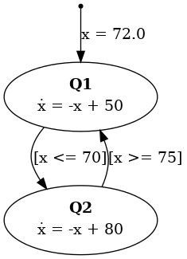

# Hybrid Automaton (HA)

This project provides a modular framework to **model**, **simulate**, and **visualize** a hybrid automata. A hybrid automaton is a formalism that combines **continuous dynamics** and **discreate events**. In the article of T. A. Henzinger, [**The theory of hybrid automata**](https://ieeexplore.ieee.org/stamp/stamp.jsp?tp=&arnumber=561342) you can find all the exlpanation of the formalism of HA. This formalsim is used in several fields such as autonomous cars [**A Hybrid System Framework to Behavior Control of Nonholonomic AGV**](https://www.iaeng.org/publication/WCECS2011/WCECS2011_pp318-324.pdf) and in biology [**Hybrid Automata as a Unifying Framework for Modeling Excitable Cells**](https://ieeexplore.ieee.org/stamp/stamp.jsp?tp=&arnumber=4462715).


## Project structure
  -  `HybridAutomaton.py` defines and builds the hybrid autoamton structure.
  -  `Simulation.py` simulate the model of HA.
  -  `VisuelAutomate.py` generates the representation and the trace of simulation of HA.

## Installation
Required packages:
```bash
pip install graphviz matplotlib
pip install pandas
```
## Main functions

### Construction of HA (`HybridAutomaton.py`)
  - `create_automate()`  initializes a new automaton structure.
  - Utility functions: `add_discrete_state`, `define_continuous_space`, `set_flow`, `set_guard`, `set_jump`,... are provided to build your model.
  - `export_automate_to_txt_with_functions(...)` saves the automaton and associated Python functions as JSON for conversion into another formalsims.

### Simulation (`Simulation.py`)
  - `simulate(A, dt, t_max, event_schedule=None)` simulates the time evolution of the automaton with optional event scheduling depending on your model if it contains event or not.
  - `plot_trace(trace, A)` plots the evolution of continuous variables and discrete states.

### Visualization (`VisuelAutomate.py`)
  - `visualiser_automate(A, filename, functions)` generates a `.png` diagram showing the representation of HA.

## Output

# HA representation
Hybrid automata describing a thermostat:
<p align="center">
  
</p>

# HA Simulation
Simulation of this hybrid system:
<p align="center">
  
</p>

# Json Structure for the conversion of the HA to HtPN
The HA could be exported in a **JSON** format in order to make a conversion into other models. The Example provided is the description of the Thermostat HA shown above:
```json

{
    "Q": [
        "Q1",
        "Q2"
    ],
    "X": [
        "x"
    ],
    "U": [],
    "E": {},
    "q0": "Q1",
    "x0": [
        72.0
    ],
    "flow": {
        "Q1": "flow_Q1",
        "Q2": "flow_Q2"
    },
    "Inv": {
        "Q1": "inv_Q1",
        "Q2": "inv_Q2"
    },
    "Guard": {
        "Q1": {
            "Q2": "guard_Q1_Q2"
        },
        "Q2": {
            "Q1": "guard_Q2_Q1"
        }
    },
    "Jump": {
        "Q1": {
            "Q2": "reset_none"
        },
        "Q2": {
            "Q1": "reset_none"
        }
    },
    "T": [
        {
            "q_from": "Q1",
            "q_to": "Q2",
            "event": null,
            "guard": "guard_Q1_Q2",
            "reset": "reset_none"
        },
        {
            "q_from": "Q2",
            "q_to": "Q1",
            "event": null,
            "guard": "guard_Q2_Q1",
            "reset": "reset_none"
        }
    ],
    "functions": {
        "flow_Q1": "def flow_Q1(x, t):\n    return [-x[0] + 50]\n",
        "flow_Q2": "def flow_Q2(x, t):\n    return [-x[0] + 80]\n",
        "inv_Q1": "def inv_Q1(x):\n    return True\n",
        "inv_Q2": "def inv_Q2(x):\n    return True\n",
        "guard_Q1_Q2": "def guard_Q1_Q2(x):\n    return x[0] <= 70\n",
        "guard_Q2_Q1": "def guard_Q2_Q1(x):\n    return x[0] >= 75\n",
        "reset_none": "def reset_none(x):\n    return x[:]\n"
    }
}

```

## Unit Tests

To ensure robustness and correctness, the project includes a suite of **unit tests** targeting the main functionalities of the hybrid automaton module.

### Test Coverage:

- The creation of an empty automaton.
- Addition of discrete states and continuous variables.
- Correct assignment of flow functions, guards, and jumps.
- Exporting to JSON structure.

The tests are located in the file:
```bash
Sources/unitary_tests.py
```

To run the tests:
```bash
python -m unittest tests/test_automaton.py
```

Example of output:
```bash
..
Test creation automaton OK
Test add discrete state OK
Test define continuous space OK
Test set initial state OK
...
----------------------------------------------------------------------
Ran n tests in 0.024s

OK
```

## Author
Developped by **HAMADI Rayen** as part of research and academic projects involving hybrid systems.
